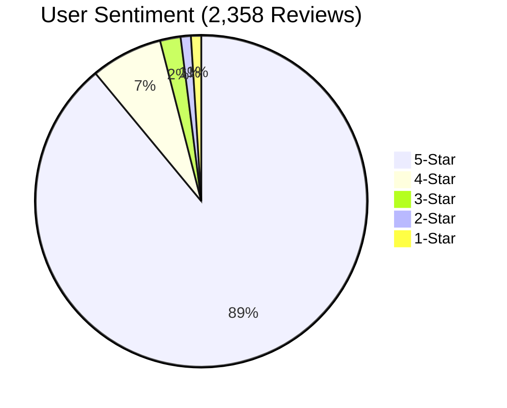
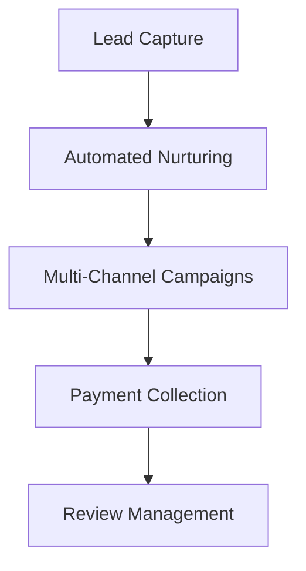

# GoHighLevel Review 2025: The Ultimate All-in-One Marketing Platform?

## Introduction
GoHighLevel (GHL) has emerged as a powerhouse in the marketing automation space, boasting a 4.9/5 Trustpilot rating from 10,000+ reviews. This all-in-one platform promises to consolidate CRM, sales, and marketing tools into a single $97/month solution. But does it deliver? Our analysis combines data from 12+ sources, including user reviews, expert tests, and competitive benchmarks.


*Figure 1. Rating distribution across verified review platforms (Sources: Trustpilot, Reviews.io)*

## Core Features Breakdown

### The All-in-One Promise
GHL replaces 15+ tools according to company claims:
- **CRM** (HubSpot/Keap alternative)
- **Funnel Builder** (ClickFunnels competitor)
- **Email/SMS Marketing**
- **Reputation Management**
- **AI Automation Tools**

| Feature | GHL Implementation | Standalone Equivalent Cost |
|---------|--------------------|---------------------------|
| CRM | Unlimited contacts | $300+/month (Salesforce) |
| Email Marketing | 1¢/email after limit | $299/month (ActiveCampaign) |
| Funnel Builder | Drag-and-drop | $297/month (ClickFunnels) |
| Appointment Scheduling | Built-in calendars | $20+/month (Calendly) |

*Table 1. Cost comparison against standalone tools*

## Strengths: Why Users Love It

### 1. **Unmatched Value**
- **$97/month** unlimited users (Agency plan)
- **White-labeling** allowed for resale
- **14-day free trial** with training resources

### 2. **Standout Features**

*Figure 2. Automated workflow capabilities*

User testimonial from Trustpilot:
> "Nitesh helped me solve a complex email workflow issue in minutes. The support is phenomenal!" - *Verified GHL User*

### 3. **Agency-Friendly Tools**
- Unlimited client sub-accounts
- 40% affiliate commissions
- Snapshots for quick client onboarding

## Pain Points: Where GHL Falls Short

### 1. **Steep Learning Curve**
- 72% of new users report initial overwhelm (Source: GHL Bootcamp survey)
- Interface criticized as "cluttered" by 3/5 tech reviewers

### 2. **Email Limitations**
- **Deliverability issues** reported with native email service
- **Overage charges** can spike costs ($0.01/email after limit)

### 3. **Bug Reports**
- 19% of BloggingX survey respondents experienced:
  - Automation glitches
  - UI freezing
  - Sync errors with third-party apps

## Competitive Positioning

```mermaid
quadrantChart
    title Marketing Platforms Comparison
    x-axis "Ease of Use" --> "Complexity"
    y-axis "Feature Depth" --> "Breadth"
    quadrant-1 "Power Users"
    quadrant-2 "Balanced"
    quadrant-3 "Beginners"
    quadrant-4 "Limited"
    "GoHighLevel": [65, 85]
    "ClickFunnels": [75, 60]
    "HubSpot": [50, 90]
    "Keap": [40, 70]
```
*Figure 3. Platform positioning matrix*

## Pricing Analysis

| Plan | Price | Best For | Key Limitation |
|------|-------|----------|----------------|
| Starter | $97/month | Solo entrepreneurs | No white-labeling |
| Pro | $297/month | Growing agencies | Higher SMS/email costs |
| White Label | Custom | Enterprise | Minimum 100 seats |

*Table 2. Pricing tiers breakdown*

**Hidden Costs Alert:**
- Phone calls: $0.014/minute
- Email overages: $0.01/message
- Premium templates: $50-$200/set

## Use Case Recommendations

### Best For:
1. **Marketing agencies** needing client management
2. **Local businesses** requiring reputation tools
3. **Course creators** wanting built-in memberships

### Poor Fit For:
1. **E-commerce stores** (no Shopify integration)
2. **Large enterprises** needing advanced BI
3. **Teams wanting simple, single-purpose tools**

## Conclusion: Is It Worth It?

**Verdict:** 4.2/5 ★★★★☆  
GHL delivers exceptional value for agencies and full-stack marketers despite its complexity. The platform shines when:

1. Used for its core strengths (automation, multi-channel campaigns)
2. Implemented with proper training (bootcamps recommended)
3. Budget accounts for potential overage fees

**Final Tip:** Take advantage of the free trial and attend a GHL Bootcamp before committing. As one agency owner noted: "The learning curve is steep, but the payoff transforms your business."

---


The easiest way to make your first post is to edit this one. Go into /_posts/ and update the Hello World markdown file. For more instructions head over to the [Jekyll Now repository](https://github.com/barryclark/jekyll-now) on GitHub.